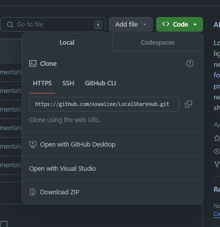
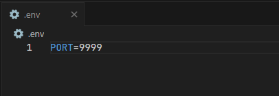

# LocalShareHub

LocalShareHub is an open-source, lightweight server designed for local networks, providing a seamless platform for collaborative text and file sharing. This project empowers users within the same network to connect, collaborate, and share code snippets or information in real-time.

# Requirements

You will need Node.js to run this application. If you don't have installed on your computer then you can install by clicking [here](https://nodejs.org/en/download).
### For Linux: 

```bash
sudo apt update
sudo apt install nodejs npm
```

You would also require [Git](https://git-scm.com/) install on your computer to download via CLI. If you don't have installed on your computer you install by clicking [here](https://git-scm.com/downloads).

# Installation

### Via CLI:

```bash
git clone https://github.com/Axwaizee/LocalShareHub.git
cd LocalShareHub
npm install
```

### Via GitHub

1. Visit https://github.com/Axwaizee/LocalShareHub.
2. Click on the **Code** button then **Download Zip**. <p align="center"></p>
3. Extract the downloaded zip file to any directory you prefer.
4. Open Terminal / Command Prompt at that Directory.
5. Run `npm install` in the terminal.

## Adding Port Configuration

After you have set all the required files and folders, add `.env` file to the root (LocalShareHub) directory. In the file give port no. as shown in `.env.sample` file. If you don't configure then by *default the PORT no. is* `3000`. Make sure the port you mention is not used by any other application on the computer.

```ini
PORT=9999
```

It should look something like:
<p align="center"></p>

# Execution

In the terminal type 
```bash 
node index.js
```
and there you go.
You can visit to the webpage via your local IP address or `localhost` and the port you mentioned. Like `IPADDRESS:PORT` for example: `192.168.0.7:3000` or `localhost:3000`.

# Feel free to contribute to the Repository!

You are most welcome to contribute to this repository by adding features, fixing bugs or improving the code. Just make sure to follow the coding guidelines and keep the project clean.

Currently, working on adding file transfer feature to this project. Would love and appreciate if you can help out with it.